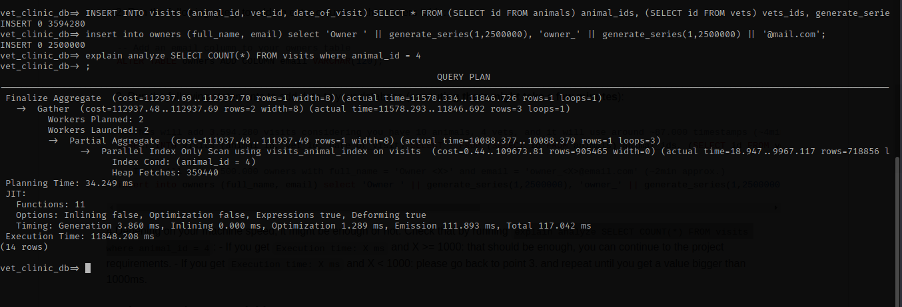
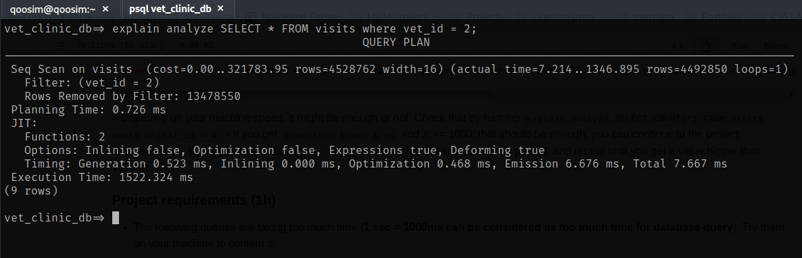
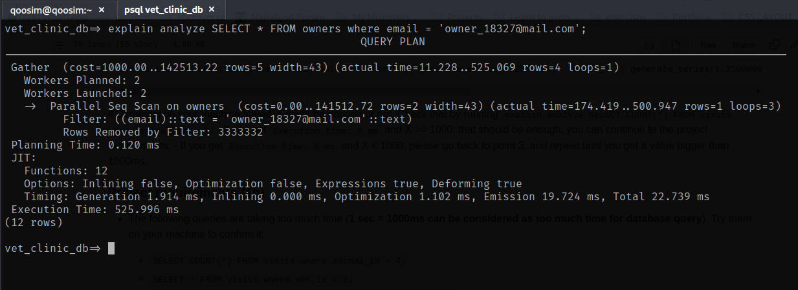
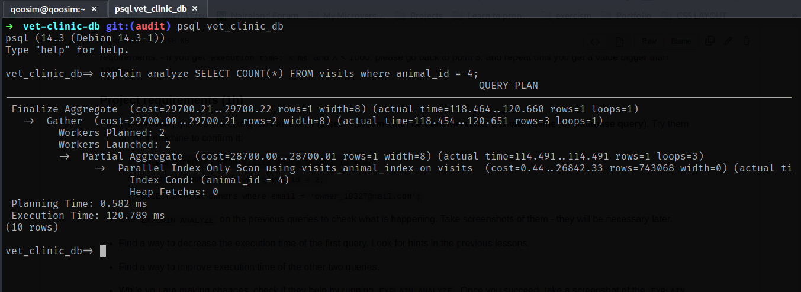
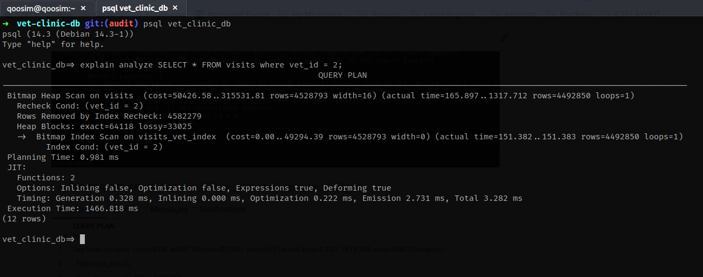
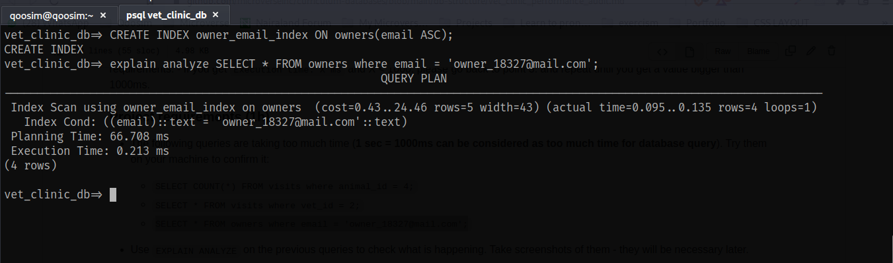

# Vet-database audit

This is an audit of a vet database using the command EXPLAIN ANALYZE of Postgresql. Performance time was improved adding indexes.

## Getting Started

This repository includes files with plain SQL that can be used to recreate a database:

- Use [schema.sql](./schema.sql) to create all tables.
- Use [data.sql](./data.sql) to populate tables with sample data.

 **Important note: this file might include queries that make changes in the database (e.g., remove records). Use them responsibly!**

## Set Up

Setup postgresql on your machine by following the steps from this [site]('https://www.linuxcapable.com/how-to-install-and-configure-postgresql-on-ubuntu-20-04/');

After a successful installation and configuration, you need to create a role(i.e user) and a database
to create your tables.
Run below commands to get started:

`sudo su - postgress` to start postgresql
`createuser -P username` to create a username (enter any name of your choice);
create a password and confirm it at the prompt terminal;
`createdb dbname -O username` to create the database under the authority of the usename used
`exit` to logout from the postgresql
`psql -h 127.0.0.1 -U username dbname` to set port for your db to run and it would open up your db for you where you can start create tables and operations on you db;

### Useful postgres commands

- `vet_clinic_db=>\d` : List tables descriptions.
- `vet_clinic_db=>\dt` : List tables.
- `vet_clinic_db=>\c dbname` : Connect to a specified db.
- `vet_clinic_db=>\dt EXPLAIN ANALYZE [Query]` Analyze a query performance

## Test performance

Three queries were tested, showing the following results.

`EXPLAIN ANALYZE SELECT COUNT(*) FROM visits where animal_id = 4;`

`EXPLAIN ANALYZE SELECT * FROM visits where vet_id = 2;`

`EXPLAIN ANALYZE SELECT * FROM owners where email = 'owner_18327@mail.com'`

## Performance improved

Index were created for improving performance.

- First query: `CREATE INDEX visits_animal_index on visits(animal_id desc);`

- Second query: `CREATE INDEX visits_vet_index ON visits(vet_id ASC);`

- Third query: `CREATE INDEX owner_email_index ON owners(email ASC);`

## Author

👤 **Qoosim Abdul**

- GitHub: [@Qoosim](https://github.com/Qoosim)
- Twitter: [@qoosim_ayinde](https://twitter.com/qoosim_ayinde)
- LinkedIn: [LinkedIn](https://www.linkedin.com/in/qoosim)

## 🤝 Contributing

Contributions, issues, and feature requests are welcome!

Feel free to check the [issues page](../../issues/).

## Show your support

Give a ⭐️ if you like this project!

## Acknowledgments

- Hat tip to anyone whose code was used
- Inspiration
- etc

## 📝 License

This project is [MIT](./MIT.md) licensed.
